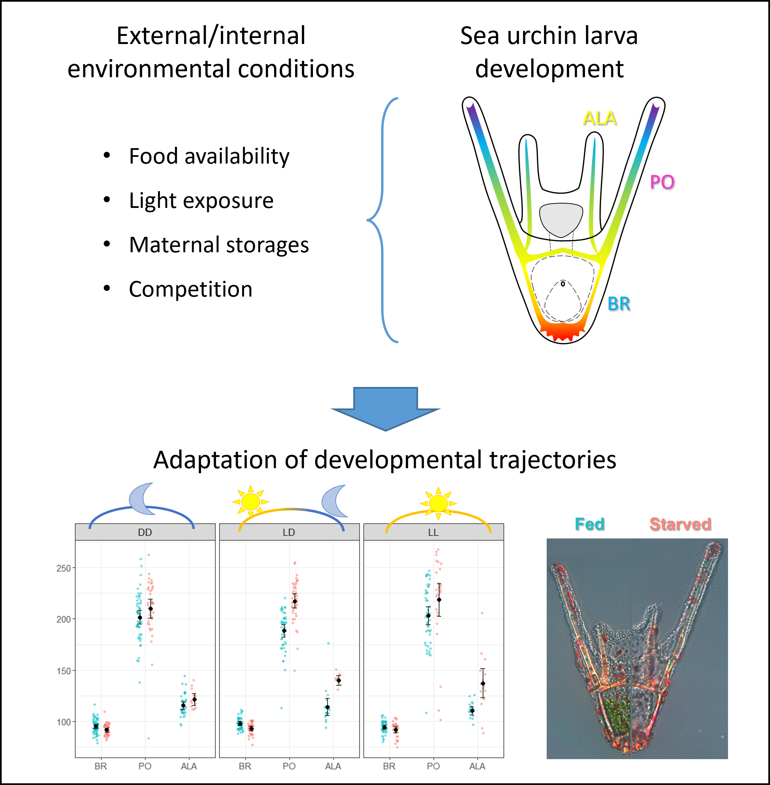

# Phenotypic response to food availability in sea urchin larvae and impact of light during development and growth

Authors: Maria Cocurullo, John D. Kirwan, Maria Ina Arnone
 
Department of Biology and Evolution of Marine Organisms, Stazione Zoologica Anton Dohrn, Naples, Italy

This repository contains statistical analysis relating to the paper [*Phenotypic response to food availability in sea urchin larvae and impact of light during development and growth*](https://www.frontiersin.org/journals/ecology-and-evolution/articles/10.3389/fevo.2025.1548208/). 

# Abstract

Phenotypic plasticity, the ability of a genotype to produce different phenotypes in response to environmental conditions, plays a crucial role in adaptation and evolution and can occur during development or adulthood. Sea urchin larvae exhibit developmental plasticity by adjusting their arm length in response to food availability. In this study, we investigated the phenotypic responses of three sea urchin species: Paracentrotus lividus and Arbacia lixula from the Mediterranean Sea, and Strongylocentrotus purpuratus from the Pacific Ocean.  In all species, we observed that larvae reared under a 12h light:12h dark cycle exhibited phenotypic responses to food availability. However, the response was suppressed in larvae reared under constant darkness, suggesting that light has a role in mediating this phenotypic plasticity. Moreover, larvae grown in constant darkness were generally smaller than those exposed to light, with the magnitude of this effect varying among species, indicating that light exposure influences not only plasticity but also baseline growth rates. These findings underscore the utility of sea urchins as a model for studying ecological and evolutionary processes shaping phenotypic responses and suggest that light has an important impact on development and growth in sea urchins.



The statistical analysis was performed using [R](https://cran.r-project.org/) version 4.4.1 .

This repository contains:

- The raw data representing measurements of larval body rods under differing experimental conditions: **larval_morphology.csv**

- **A_lixula_mixeff_distributional.Rmd**, **P_lividus_mixeff_distributional.Rmd**, and  **S_purpuratus_mixeff_distributional.Rmd** contain data analysis for the three species, *A. lixula*, *P. lividus* and *S. purpuratus*, respectively. These include data summary, probabilsitic modelling using brms and Stan, prior predictive tests and model evaluation via LOO. A best model is chosen and the model formula is described.  

- **A_lixula_model_visualization.Rmd**, **P_lividus_model_visualization.Rmd**, and **S_purpuratus_model_visualization.Rmd** contain visualization of the predictions of best models for the three species, juxtaposed with the original data.  

- The directory [pdfs](pdfs/) contains the six PDF documents represent 'knitted' versions of the R Markdown (Rmd) files listed above for which the code has been run.

- The three .rds data files in [releases/download/v1.0.0/](releases/download/v1.0.0/) represent the model objects for the three species which are visualized in the *_model_visualization.Rmd files and described in the research article. 
  
- **renv.lock** this file records all the packages and their versions used in the project. It enables recreating the same environment on a different machine by reinstalling these packages. To restore the R package environment from renv.lock, run the following command in R:
```r
install.packages("renv")  # If renv is not already installed
renv::restore()
```
For more info on renv: https://rstudio.github.io/renv/articles/renv.html

The Stan code for the best model applied to each species is found in the [stan_code](/stan_code/) directory.
